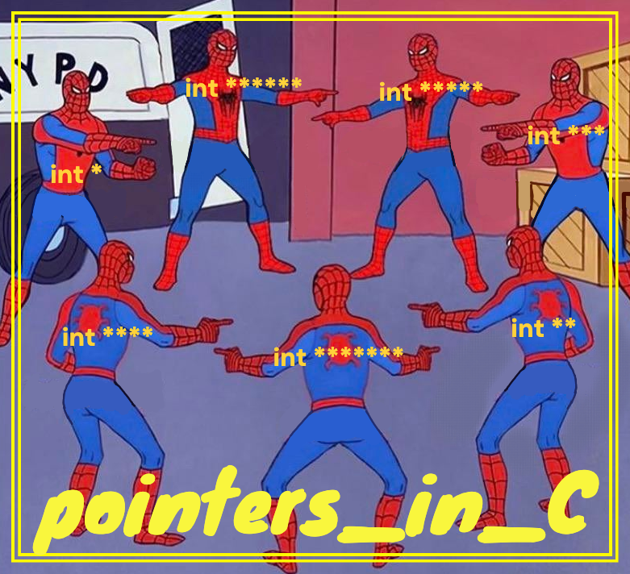

  

## 🚀 SYNOPSIS

This repo is a support for a workshop during 42 piscine aimed at detailing and explaining pointers in C.

You'll find C code covering the basics of variables and scope, as well as examples of how to use pointers as function arguments.
